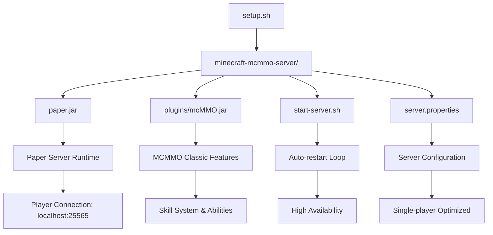

# Minecraft MCMMO Server

A fully automated, single-player optimized Minecraft server setup featuring **MCMMO Classic** for skill progression and leveling. This project provides a complete, ready-to-run Minecraft server environment with minimal configuration required.

## 📋 Project Overview

This is a **Paper-based Minecraft 1.21.6 server** specifically configured for:
- **Single-player MCMMO gameplay** with skill leveling system
- **Automated setup and deployment** via shell scripts
- **Production-ready configuration** with optimized JVM flags
- **Plugin ecosystem** including Spark performance monitoring

### Current State ✅

The server is **fully configured and operational** with:
- ✅ Paper 1.21.6 server installed (`paper.jar`)
- ✅ MCMMO Classic plugin active (`mcMMO.jar`)
- ✅ EULA accepted (`eula=true`)
- ✅ Optimized server properties for single-player experience
- ✅ Performance monitoring with Spark plugin
- ✅ JVM memory allocation: 4GB max, 2GB min with G1GC
- ✅ Auto-restart functionality built into start script

---

## 🚀 **USAGE** (Optimized Section)

### Prerequisites
- **Java 21** (OpenJDK recommended from [Adoptium](https://adoptium.net))
- **4GB+ RAM** available for server allocation
- **Minecraft Java Edition** client

### Quick Start (30 seconds)

1. **Navigate to server directory:**
   ```bash
   cd minecraft-mcmmo-server
   ```

2. **Launch server:**
   ```bash
   ./start-server.sh
   ```
   *On Windows: Double-click `start-server.bat`*

3. **Wait for "Done!" message** (typically 15-30 seconds)

4. **Connect from Minecraft:**
   - Open Minecraft → Multiplayer → Add Server
   - **Server Address:** `localhost`
   - Connect and start playing!

### Essential MCMMO Commands

| Command | Description | Example |
|---------|-------------|---------|
| `/mcstats` | View your skill levels | Shows all skill XP/levels |
| `/mctop [skill]` | Leaderboards | `/mctop mining` |
| `/mcability` | Toggle skill abilities | Enable/disable special abilities |
| `/mcscoreboard` | Toggle skill scoreboard | Show skills on screen |
| `/inspect [player]` | View player stats | `/inspect Steve` |

### Server Management

- **Stop Server:** `Ctrl+C` in terminal (auto-restarts by default)
- **Admin Commands:** Use `/op <username>` to grant admin privileges
- **Performance Monitoring:** `/spark profiler` (Spark plugin commands)
- **Configuration:** Edit `server.properties` for server settings

### File Structure
```
minecraft-mcmmo-server/
├── paper.jar              # Paper server executable
├── start-server.sh        # Launch script with auto-restart
├── server.properties      # Server configuration
├── eula.txt              # License acceptance
├── plugins/
│   ├── mcMMO.jar         # MCMMO Classic plugin
│   └── spark/            # Performance monitoring
├── world/                # Generated world data
└── cache/                # Downloaded dependencies
```

---

## 🤖 **AGENTIC CODING** (Optimized Section)

This section provides comprehensive guidance for AI agents working on this codebase, including architectural patterns, automation opportunities, and development workflows.

### Architecture Overview



### Automation Targets

#### High-Priority Automation Opportunities

1. **Plugin Management System**
   ```bash
   # Current: Manual plugin downloads
   # Target: Automated plugin lifecycle management
   
   suggested_structure/
   ├── plugins.yml          # Plugin definitions with versions
   ├── scripts/
   │   ├── update-plugins.sh
   │   ├── install-plugin.sh
   │   └── remove-plugin.sh
   ```

2. **Configuration Management**
   ```yaml
   # Target: YAML-based configuration system
   server:
     memory: "4G"
     java_flags: ["UseG1GC", "ParallelRefProcEnabled"]
     plugins:
       mcmmo:
         enabled: true
         version: "latest"
         config_overrides:
           skills.mining.enabled: true
   ```

3. **Backup & World Management**
   ```bash
   # Automation targets:
   # - Scheduled world backups
   # - World reset/regeneration tools  
   # - Save file compression and archival
   ```

#### Development Patterns for Agents

**File Modification Patterns:**
- Always backup `server.properties` before modifications
- Use atomic replacements for configuration files
- Validate Java syntax for startup script changes
- Test plugin compatibility before deployment

**Common Agent Tasks:**
```bash
# Plugin Installation Pattern
curl -L -o "plugins/${PLUGIN_NAME}.jar" "${DOWNLOAD_URL}"
# Restart server to load new plugin
pkill -f "paper.jar"
./start-server.sh &

# Configuration Update Pattern  
cp server.properties server.properties.backup
sed -i "s/^${KEY}=.*/${KEY}=${VALUE}/" server.properties

# Memory Optimization Pattern
# Modify start-server.sh with calculated JVM flags based on system resources
```

### Agent Development Guidelines

#### File Safety Protocols
- **Critical Files:** `server.properties`, `start-server.sh`, `eula.txt`
- **Safe to Modify:** Plugin configs, world files (with backup)
- **Never Modify:** `paper.jar`, `mcMMO.jar` (use replacement instead)

#### Testing Automation
```bash
# Validation script template for agents
validate_server() {
    # 1. Check Java availability
    java -version || return 1
    
    # 2. Validate paper.jar exists and is executable
    [ -f "paper.jar" ] || return 1
    
    # 3. Check EULA acceptance
    grep -q "eula=true" eula.txt || return 1
    
    # 4. Test server startup (dry run)
    timeout 30s java -jar paper.jar --help >/dev/null 2>&1
}
```

#### Common Integration Points

1. **Log Analysis:** Server logs at `logs/latest.log`
2. **Plugin Data:** Individual plugin folders in `plugins/`
3. **World Modification:** Direct world file access in `world/`
4. **Performance Metrics:** Via Spark plugin API
5. **Configuration Updates:** Hot-reload supported for most settings

#### Error Handling Patterns
```bash
# Robust server start with error handling
start_server_safely() {
    local max_attempts=3
    local attempt=1
    
    while [ $attempt -le $max_attempts ]; do
        echo "Attempt $attempt to start server..."
        
        if java -Xmx4G -Xms2G -jar paper.jar --nogui; then
            echo "Server started successfully"
            return 0
        else
            echo "Server start failed (attempt $attempt)"
            ((attempt++))
            sleep 5
        fi
    done
    
    echo "Failed to start server after $max_attempts attempts"
    return 1
}
```

---

## 🔧 Technical Details

### Server Specifications
- **Server Type:** Paper (Bukkit/Spigot fork)
- **Minecraft Version:** 1.21.6
- **Java Version:** OpenJDK 21 (Homebrew installation detected)
- **Memory Allocation:** 2GB-4GB with G1 Garbage Collector
- **Network:** localhost:25565 (single-player optimized)

### Plugin Ecosystem
- **MCMMO Classic:** Skill leveling and RPG mechanics
- **Spark:** Performance profiling and monitoring
- **bStats:** Anonymous usage statistics

### JVM Optimization Flags
```bash
-Xmx4G -Xms2G                     # Memory allocation
-XX:+UseG1GC                      # G1 garbage collector
-XX:+ParallelRefProcEnabled       # Parallel reference processing
```

## 🚨 Troubleshooting

### Common Issues

**"Unable to access jarfile paper.jar"**
- **Cause:** Working directory mismatch
- **Solution:** Ensure you're in `minecraft-mcmmo-server/` directory
- **Command:** `cd minecraft-mcmmo-server && ./start-server.sh`

**Server won't start**
- Check Java installation: `java -version`
- Verify EULA acceptance: `cat eula.txt` should show `eula=true`
- Check available memory: Reduce `-Xmx4G` to `-Xmx2G` if needed

**Cannot connect from Minecraft**
- Verify server is running (look for "Done!" message)
- Use exactly `localhost` as server address
- Ensure server-port=25565 in server.properties

### Performance Tuning
- **Low RAM systems:** Reduce memory allocation in `start-server.sh`
- **High latency:** Adjust `view-distance` in `server.properties`
- **Plugin conflicts:** Check `logs/latest.log` for error messages

## 📝 Development History

This server was configured using automated setup scripts with the following components:
- Automated Paper server download (latest 1.21.6 build)
- MCMMO Classic from Jenkins CI (latest successful build)
- Production-ready configuration templates
- Cross-platform compatibility (Linux/macOS/Windows)

---

**Project Status:** ✅ Ready for Use | 🔧 Actively Maintainable | 🤖 Agent-Friendly 